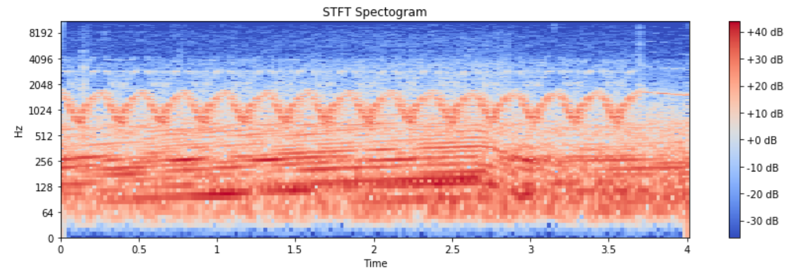
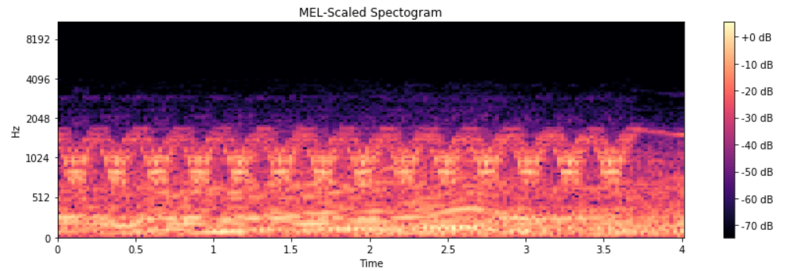
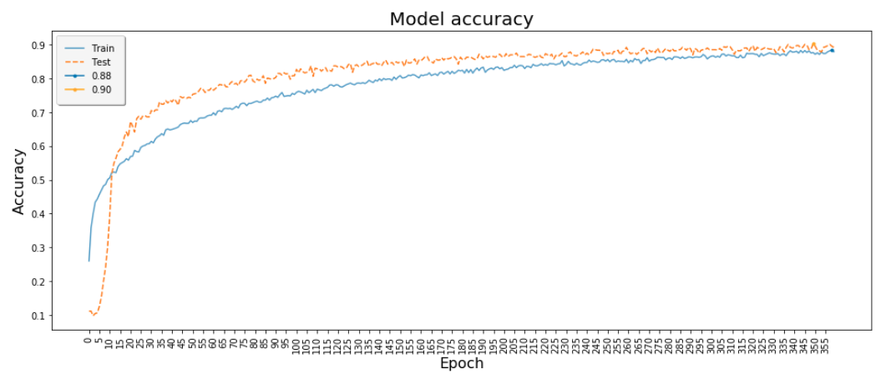

# Lambda Notes

### Install

```
git clone https://github.com/lambdal/urban-audio-classifier.git
cd urban-audio-classifier

virtualenv -p /usr/bin/python3.6 venv

. venv/bin/activate

pip install tensorflow-gpu==1.15.3
pip install keras==2.3.1
pip install librosa
pip install numpy
pip install pandas
pip install matplotlib
pip install scikit-learn
pip install ipython
pip install jupyter
pip install ipykernel

ipython kernel install --user --name=venv
```

### Task

The goal of this demo is to build a neural network to classify 10 different urban sound. After trained, the network is able to get classification accuracy of more than 90%, while a random guess will be around 10%.

We use the UrbanSound8K dataset, which contains 8732 labeled sound slices of varying duration up to 4 seconds. The categorization labels being:

1. Air Conditioner
1. Car Horn
1. Children Playing
1. Dog bark
1. Drilling
1. Engine Idling
1. Gun Shot
1. Jackhammer
1. Siren
1. Street Music


Below is a spectrogram of the spectrum of frequencies of a signal as it varies with time: a windowing function is applied to each audio frame, then the Short-Term Fourier Transform (STFT) is computed on each frame, finally the power spectrum and filter banks are computed. 




Instead of STFT, this project uses MEL-Scaled filter banks, which takes into account human perception for sensitivity at appropriate frequencies by converting the conventional frequency to Mel Scale (which is not linear but logarithmic).




### Model

The network used in this project has four convolution layers, one dense layers. Batch normalization is used to speed up the training. This is the summary of the model:

```
Layer (type)                 Output Shape              Param #   
=================================================================
conv2d_1 (Conv2D)            (None, 38, 172, 32)       320       
_________________________________________________________________
leaky_re_lu_1 (LeakyReLU)    (None, 38, 172, 32)       0         
_________________________________________________________________
batch_normalization_1 (Batch (None, 38, 172, 32)       128       
_________________________________________________________________
spatial_dropout2d_1 (Spatial (None, 38, 172, 32)       0         
_________________________________________________________________
conv2d_2 (Conv2D)            (None, 36, 170, 32)       9248      
_________________________________________________________________
leaky_re_lu_2 (LeakyReLU)    (None, 36, 170, 32)       0         
_________________________________________________________________
batch_normalization_2 (Batch (None, 36, 170, 32)       128       
_________________________________________________________________
max_pooling2d_1 (MaxPooling2 (None, 18, 85, 32)        0         
_________________________________________________________________
spatial_dropout2d_2 (Spatial (None, 18, 85, 32)        0         
_________________________________________________________________
conv2d_3 (Conv2D)            (None, 16, 83, 64)        18496     
_________________________________________________________________
leaky_re_lu_3 (LeakyReLU)    (None, 16, 83, 64)        0         
_________________________________________________________________
batch_normalization_3 (Batch (None, 16, 83, 64)        256       
_________________________________________________________________
spatial_dropout2d_3 (Spatial (None, 16, 83, 64)        0         
_________________________________________________________________
conv2d_4 (Conv2D)            (None, 14, 81, 64)        36928     
_________________________________________________________________
leaky_re_lu_4 (LeakyReLU)    (None, 14, 81, 64)        0         
_________________________________________________________________
batch_normalization_4 (Batch (None, 14, 81, 64)        256       
_________________________________________________________________
global_average_pooling2d_1 ( (None, 64)                0         
_________________________________________________________________
dense_1 (Dense)              (None, 10)                650       
=================================================================
Total params: 66,410
Trainable params: 66,026
Non-trainable params: 384
```

### Data Preparation


Download pre-generated spectrogram data

```
cd data
wget https://lambdalabs-files.s3-us-west-2.amazonaws.com/Navy/UrbanSound8K/X-mel_spec.npy
wget https://lambdalabs-files.s3-us-west-2.amazonaws.com/Navy/UrbanSound8K/y-mel_spec.npy
cd ..
```

Or, you can generate your own pre-processed data

Download [UrbanSound8K](https://urbansounddataset.weebly.com/download-urbansound8k.html) dataset to `urban-audio-classifier/UrbanSound8K`

```
pythons script_pre_processing.py
```

### Train and Evaluation

```
# With CPU
CUDA_VISIBLE_DEVICES= python demo_cnn.py

# With single GPU
python demo_cnn.py

# With multiple GPUs
python demo_cnn_multi_gpu.py
```


### Run Jupyter Notebook On a Remote server

Step 1: Install this repo on remove server (remoteuser@remotehost). See [Install](#install)


Step 2: Lauch notebook on the server. Chose your own port number for `XXXX`, for example, 5000

```
# On remote machine
. venv/bin/activate
jupyter notebook --no-browser --port=5000

# It will show something like
http://localhost:5000/?token=73cc2dad5acd168351ed1fe56b2c9dc6138da5acd9ac333b
```


Step 3: Install Jupyter and ipython on local machine

```
virtualenv -p /usr/bin/python3.6 venv
. venv/bin/activate

pip install jupyter
pip install ipython
```


Step 4: Forward port `XXXX` (e.g. 5000) on server to `YYYY` (e.g. 6000) on local machine, and listen to it.

```
# On local machine
. venv/bin/activate
ssh -N -f -L localhost:6000:localhost:5000 remoteuser@remotehost
```

Step 5: Fire-up Jupyter Notebook on local machine

```
# On local machine, open a web browswer, go to localhost:YYYY
localhost:6000

# You will be asked to fill in a token for the first time you connect to the server. 
# Simply use the token from the server's terminal 
# For example, 73cc2dad5acd168351ed1fe56b2c9dc6138da5acd9ac333b in the above example

# You should be able to see Jupyter notebook GUI in your browser now
# Go to the notebook you want to try
# Goto "Kernel" -> "Change Kernel", and select "venv", which is the virtual envrionment on remote server
```


### Results

#### Accuracy


#### Time to Solution (seconds)
|   | CPU  | 1xGPU | 2xGPU |
|---|---|---|---|
| CNN | 21600  | 720  | 360  |

#### Training Speed
|   | CPU  | 1xGPU | 2xGPU |
|---|---|---|---|
| CNN (sec/epoch) | 60  | 2  | 1  |
